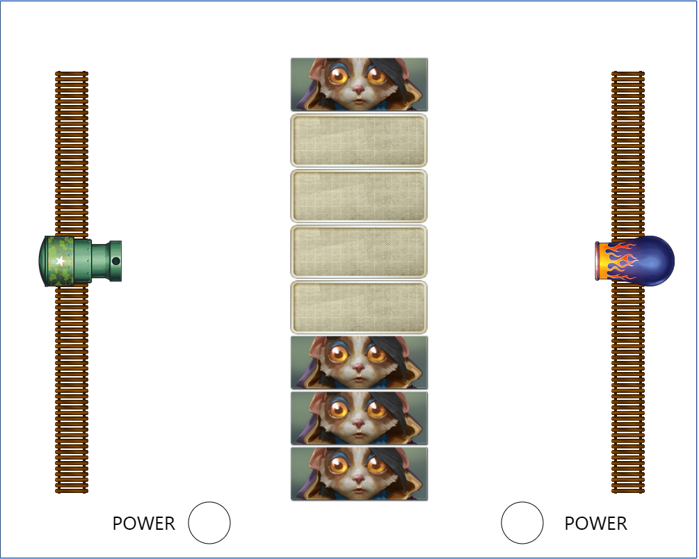
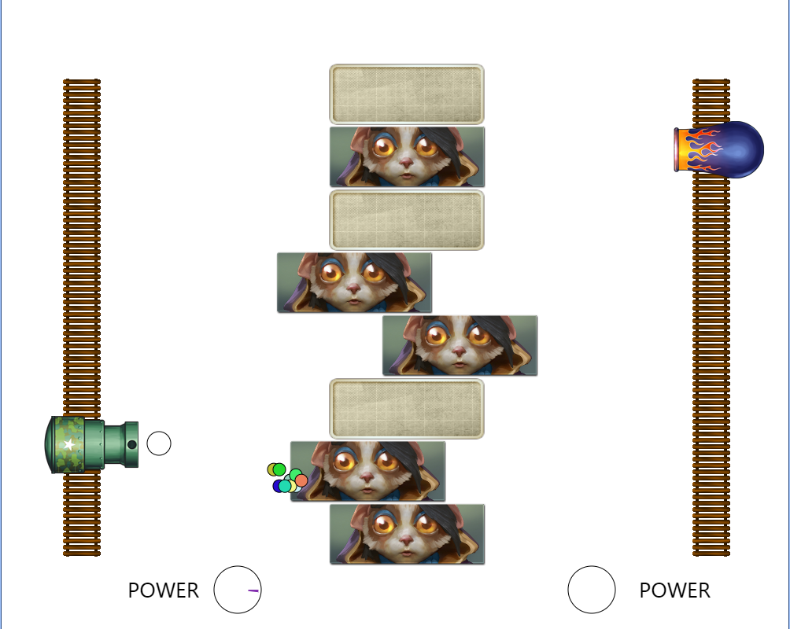

# hit-the-block
一个简单的双人小游戏\
A little double game base on canvas
## 操作方式（Operation method）
只有两个按键，玩家1使用‘S’键，玩家2使用‘5’键\
Only two keys, player 1 use the 'S' key, player 2 use the' 5 'key\

会根据按键时间的长短分配打击力度\
Distribution of strike strength based on the length of the keystroke
## 截图（ScreenCut）

## 预览（Preview）
 https://dlcnow.github.io/hit-the-block/